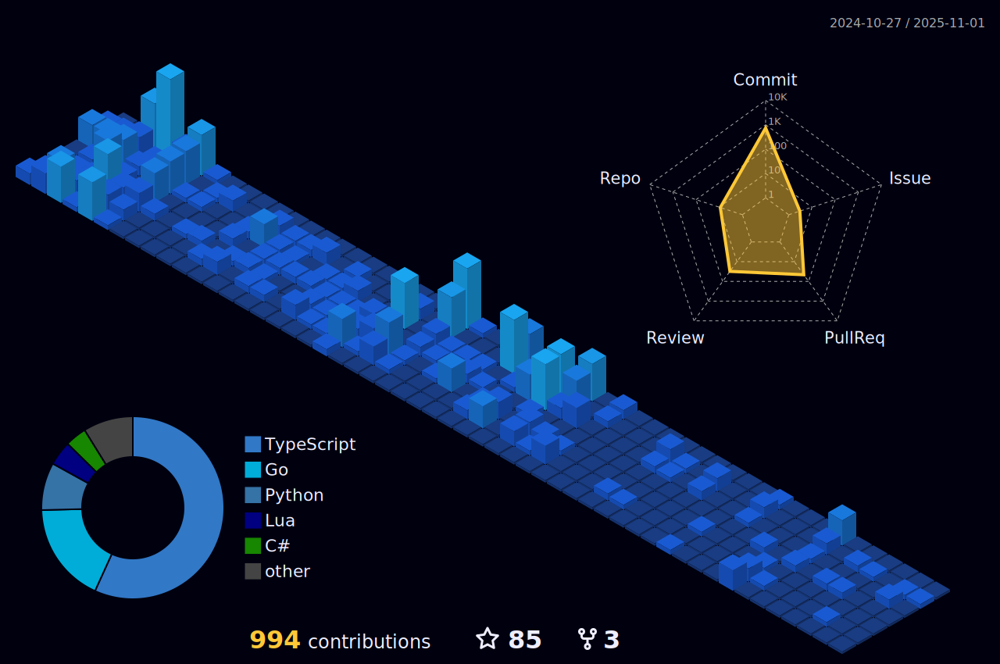

### I'm a Full-Stack Developer and Database Technology student at FATEC São José dos Campos - Prof. Jessen Vidal.

  

<a href="https://github.com/paulo-granthon">
  

    
      
    

</a>

<!--   profile-green-animate -->

