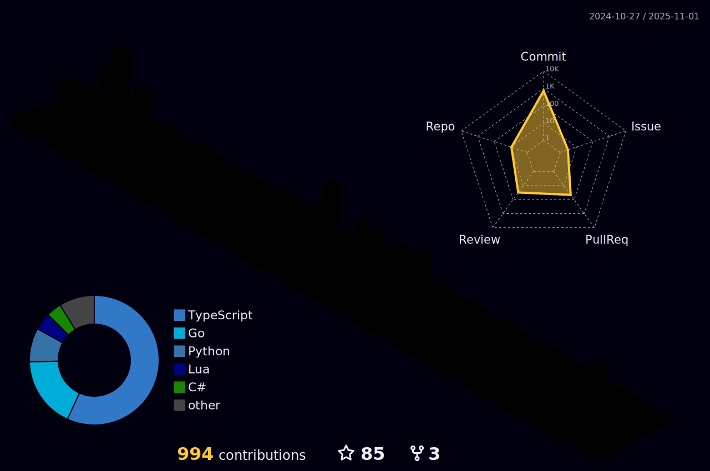

  

  <h1 align="center"><b><i>I absolutely love programing!</i></b></h1>

  

  
<i>Ever since my childhood, I have been captivated by technology, constantly questioning how the games I played, the websites I accessed, and other daily technologies were created. The intricate puzzle of designing, developing, and integrating all the components fascinated me.</i>

  
<i>I was unwavering in my determination to unravel this magic and bring my own ideas to life, no matter the challenges I faced or the difficulties I encountered. Fuelled by curiosity and passion, I embarked on a journey of independent research and study, honing my skills and acquiring the necessary tools to make programming an integral part of my life.</i>

  
  
<i>Today, I stand on the path of turning my childhood dream into reality. I have come a long way, pursuing my university education while expanding my knowledge, building my portfolio, and advancing my career as a developer.</i>

  
<i>This profile showcases my latest personal projects and contributions, offering insights into my dedication, proficiency, and relentless passion for knowledge and technology. Additionally, you will find informative statistics that provide further context and highlight the consistency and impact of my work.</i>

 

  

  <h4><b>Some of the technologies I'm confident working with:<b></h4>
    
    
    
    
    
    
    
    
    
    

  <h4><b>You can also find me on:<b></h4>
    

